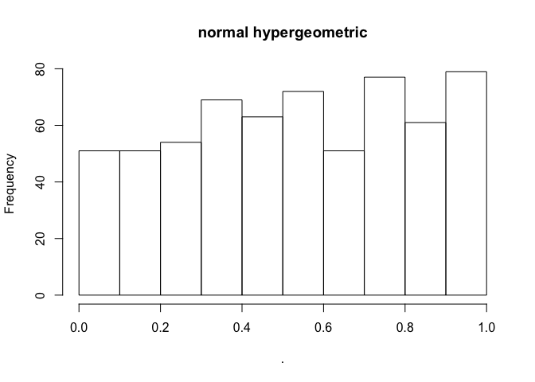
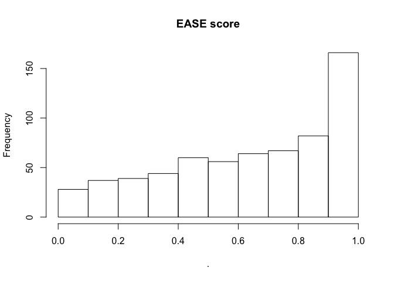

golite
================

Installation
------------

Install the package with:

``` r
library(devtools)
install_github("ZhenWei10/golite")
```

Run GO enrichment analysis
--------------------------

The necessary input of goea should be the gene set gene ID, background gene ID, and the [orgDb object](http://www.bioconductor.org/packages/release/data/annotation/html/org.Hs.eg.db.html).

``` r
library(golite)
library(magrittr)
library(org.Hs.eg.db)
```

Use randomly sampled gene IDs for gene set and background.

``` r
library(TxDb.Hsapiens.UCSC.hg19.knownGene)
txdb = TxDb.Hsapiens.UCSC.hg19.knownGene
all_eids_hg19 <- names(genes(txdb))

set.seed(1)
eids_bg <- sample(all_eids_hg19, 3500)
eids_set <- sample(eids_bg,300)
```

Run GO enrichment analysis given gene set and background.

``` r
goea(gene_set = eids_set,
     back_ground = eids_bg,
     orgDb = org.Hs.eg.db,
     interpret_term = T) %>% head(.,10) %>% knitr::kable(.,"markdown")
```

    ## Loading required package: GO.db

<table>
<colgroup>
<col width="10%" />
<col width="49%" />
<col width="7%" />
<col width="7%" />
<col width="9%" />
<col width="9%" />
<col width="5%" />
</colgroup>
<thead>
<tr class="header">
<th align="left">term</th>
<th align="left">definition</th>
<th align="right">freq_gs</th>
<th align="right">freq_bg</th>
<th align="right">p</th>
<th align="right">adj_BH</th>
<th align="right">OR</th>
</tr>
</thead>
<tbody>
<tr class="odd">
<td align="left"><a href="GO:0009967" class="uri">GO:0009967</a></td>
<td align="left">positive regulation of signal transduction</td>
<td align="right">29</td>
<td align="right">191</td>
<td align="right">0.0012078</td>
<td align="right">0.5996853</td>
<td align="right">1.77</td>
</tr>
<tr class="even">
<td align="left"><a href="GO:0010647" class="uri">GO:0010647</a></td>
<td align="left">positive regulation of cell communication</td>
<td align="right">32</td>
<td align="right">225</td>
<td align="right">0.0020695</td>
<td align="right">0.5996853</td>
<td align="right">1.66</td>
</tr>
<tr class="odd">
<td align="left"><a href="GO:0023056" class="uri">GO:0023056</a></td>
<td align="left">positive regulation of signaling</td>
<td align="right">32</td>
<td align="right">225</td>
<td align="right">0.0020695</td>
<td align="right">0.5996853</td>
<td align="right">1.66</td>
</tr>
<tr class="even">
<td align="left"><a href="GO:0006672" class="uri">GO:0006672</a></td>
<td align="left">ceramide metabolic process</td>
<td align="right">3</td>
<td align="right">4</td>
<td align="right">0.0023288</td>
<td align="right">0.5996853</td>
<td align="right">8.75</td>
</tr>
<tr class="odd">
<td align="left"><a href="GO:2001235" class="uri">GO:2001235</a></td>
<td align="left">positive regulation of apoptotic signaling pathway</td>
<td align="right">7</td>
<td align="right">24</td>
<td align="right">0.0030061</td>
<td align="right">0.5996853</td>
<td align="right">3.40</td>
</tr>
<tr class="even">
<td align="left"><a href="GO:0045859" class="uri">GO:0045859</a></td>
<td align="left">regulation of protein kinase activity</td>
<td align="right">17</td>
<td align="right">101</td>
<td align="right">0.0045006</td>
<td align="right">0.5996853</td>
<td align="right">1.96</td>
</tr>
<tr class="odd">
<td align="left"><a href="GO:0071900" class="uri">GO:0071900</a></td>
<td align="left">regulation of protein serine/threonine kinase activity</td>
<td align="right">12</td>
<td align="right">61</td>
<td align="right">0.0045852</td>
<td align="right">0.5996853</td>
<td align="right">2.30</td>
</tr>
<tr class="even">
<td align="left"><a href="GO:0043408" class="uri">GO:0043408</a></td>
<td align="left">regulation of MAPK cascade</td>
<td align="right">15</td>
<td align="right">85</td>
<td align="right">0.0047575</td>
<td align="right">0.5996853</td>
<td align="right">2.06</td>
</tr>
<tr class="odd">
<td align="left"><a href="GO:1902531" class="uri">GO:1902531</a></td>
<td align="left">regulation of intracellular signal transduction</td>
<td align="right">34</td>
<td align="right">256</td>
<td align="right">0.0047870</td>
<td align="right">0.5996853</td>
<td align="right">1.55</td>
</tr>
<tr class="even">
<td align="left"><a href="GO:0060538" class="uri">GO:0060538</a></td>
<td align="left">skeletal muscle organ development</td>
<td align="right">6</td>
<td align="right">20</td>
<td align="right">0.0051416</td>
<td align="right">0.5996853</td>
<td align="right">3.50</td>
</tr>
</tbody>
</table>

The function can be vectorized, i.e. the input can be a `list` of multiple gene sets.

``` r
eids_sets <- lapply(1:10,function(x) sample(eids_bg,300)) 

goea(gene_set = eids_sets,
     back_ground = eids_bg,
     orgDb = org.Hs.eg.db) %>% summary
```

    ##       Length Class      Mode
    ##  [1,] 6      data.frame list
    ##  [2,] 6      data.frame list
    ##  [3,] 6      data.frame list
    ##  [4,] 6      data.frame list
    ##  [5,] 6      data.frame list
    ##  [6,] 6      data.frame list
    ##  [7,] 6      data.frame list
    ##  [8,] 6      data.frame list
    ##  [9,] 6      data.frame list
    ## [10,] 6      data.frame list

Run GO slim enrichment analysis
-------------------------------

GO slim is a subset of GO terms that can be defined at [here](http://geneontology.org/ontology/subsets/).

``` r
goea(gene_set = eids_set,
     back_ground = eids_bg,
     orgDb = org.Hs.eg.db,
     interpret_term = T,
     GO_Slim = T)  %>% head(.,10) %>% knitr::kable(.,"markdown")
```

| term         | definition                           |  freq\_gs|  freq\_bg|          p|    adj\_BH|    OR|
|:-------------|:-------------------------------------|---------:|---------:|----------:|----------:|-----:|
| <GO:0006629> | lipid metabolic process              |        25|       187|  0.0141012|  0.5162342|  1.56|
| <GO:0008219> | cell death                           |        39|       327|  0.0156435|  0.5162342|  1.39|
| <GO:0048856> | anatomical structure development     |        83|       848|  0.0683518|  0.9268498|  1.14|
| <GO:0040007> | growth                               |        17|       140|  0.0852517|  0.9268498|  1.42|
| <GO:0007165> | signal transduction                  |        77|       795|  0.0988005|  0.9268498|  1.13|
| <GO:0021700> | developmental maturation             |         6|        40|  0.1221631|  0.9268498|  1.75|
| <GO:0006790> | sulfur compound metabolic process    |         7|        51|  0.1415087|  0.9268498|  1.60|
| <GO:0043473> | pigmentation                         |         2|         8|  0.1453356|  0.9268498|  2.92|
| <GO:0071554> | cell wall organization or biogenesis |         1|         2|  0.1641360|  0.9268498|  5.83|
| <GO:0007049> | cell cycle                           |        26|       250|  0.1651823|  0.9268498|  1.21|

you could set `EASE_score = TRUE` to get a more conservative p value.

For more information of EASE, please see [here](https://david.ncifcrf.gov/helps/functional_annotation.html#fisher).

``` r
goea(gene_set = eids_sets,
     back_ground = eids_bg, 
     orgDb = org.Hs.eg.db,
     GO_Slim = T,
     EASE_Score = F) %>% lapply(.,function(x)x$p) %>% unlist %>% hist(main = "normal hypergeometric")
```



``` r
goea(gene_set = eids_sets,
         back_ground = eids_bg,
     orgDb = org.Hs.eg.db,
     GO_Slim = T,
     EASE_Score = T) %>% lapply(.,function(x)x$p) %>% unlist %>% hist(main = "EASE score")
```



with any questions, please contact <zhen.wei@xjtlu.edu.cn>.

``` r
sessionInfo()
```

    ## R version 3.4.2 (2017-09-28)
    ## Platform: x86_64-apple-darwin15.6.0 (64-bit)
    ## Running under: macOS Sierra 10.12.6
    ## 
    ## Matrix products: default
    ## BLAS: /Library/Frameworks/R.framework/Versions/3.4/Resources/lib/libRblas.0.dylib
    ## LAPACK: /Library/Frameworks/R.framework/Versions/3.4/Resources/lib/libRlapack.dylib
    ## 
    ## locale:
    ## [1] zh_CN.UTF-8/zh_CN.UTF-8/zh_CN.UTF-8/C/zh_CN.UTF-8/zh_CN.UTF-8
    ## 
    ## attached base packages:
    ## [1] parallel  stats4    stats     graphics  grDevices utils     datasets 
    ## [8] methods   base     
    ## 
    ## other attached packages:
    ##  [1] GO.db_3.5.0                            
    ##  [2] TxDb.Hsapiens.UCSC.hg19.knownGene_3.2.2
    ##  [3] GenomicFeatures_1.30.3                 
    ##  [4] GenomicRanges_1.30.3                   
    ##  [5] GenomeInfoDb_1.14.0                    
    ##  [6] org.Hs.eg.db_3.5.0                     
    ##  [7] AnnotationDbi_1.40.0                   
    ##  [8] IRanges_2.12.0                         
    ##  [9] S4Vectors_0.16.0                       
    ## [10] Biobase_2.38.0                         
    ## [11] BiocGenerics_0.24.0                    
    ## [12] magrittr_1.5                           
    ## [13] golite_1.0                             
    ## 
    ## loaded via a namespace (and not attached):
    ##  [1] Rcpp_0.12.16               highr_0.6                 
    ##  [3] compiler_3.4.2             XVector_0.18.0            
    ##  [5] prettyunits_1.0.2          bitops_1.0-6              
    ##  [7] tools_3.4.2                zlibbioc_1.24.0           
    ##  [9] progress_1.1.2             biomaRt_2.34.2            
    ## [11] digest_0.6.15              bit_1.1-12                
    ## [13] lattice_0.20-35            RSQLite_2.0               
    ## [15] evaluate_0.10.1            memoise_1.1.0             
    ## [17] pkgconfig_2.0.1            Matrix_1.2-12             
    ## [19] DelayedArray_0.4.1         DBI_0.8                   
    ## [21] yaml_2.1.18                GenomeInfoDbData_1.0.0    
    ## [23] rtracklayer_1.38.3         httr_1.3.1                
    ## [25] stringr_1.3.0              knitr_1.20                
    ## [27] Biostrings_2.46.0          grid_3.4.2                
    ## [29] rprojroot_1.3-2            bit64_0.9-7               
    ## [31] R6_2.2.2                   BiocParallel_1.12.0       
    ## [33] XML_3.98-1.10              RMySQL_0.10.14            
    ## [35] rmarkdown_1.9              blob_1.1.1                
    ## [37] matrixStats_0.53.1         GenomicAlignments_1.14.2  
    ## [39] Rsamtools_1.30.0           backports_1.1.2           
    ## [41] htmltools_0.3.6            SummarizedExperiment_1.8.1
    ## [43] assertthat_0.2.0           stringi_1.1.7             
    ## [45] RCurl_1.95-4.10
